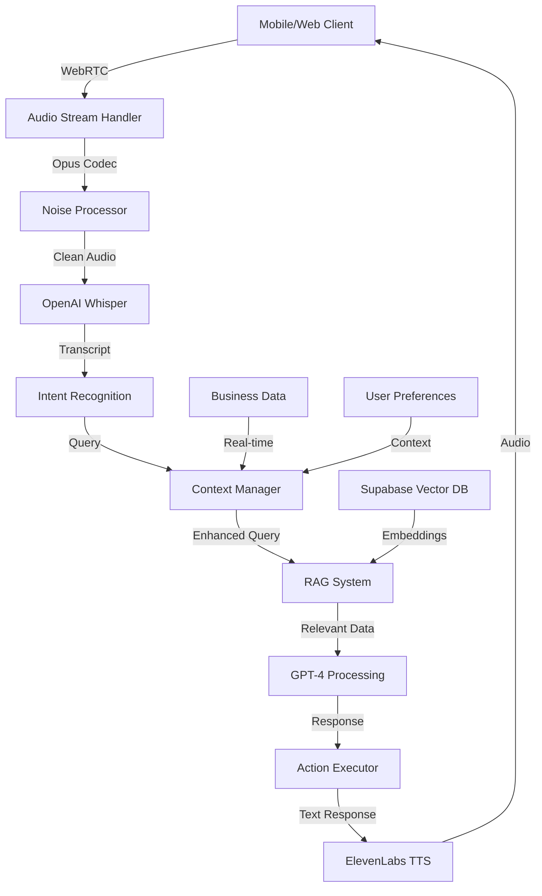

# AI Voice Assistant Architecture
## Crown Jewel Feature - Technical Implementation Guide

**Version**: 1.0
**Date**: September 30, 2025
**Status**: Phase 4 Priority Feature

---

## 🌟 Vision Statement

Build the industry's first truly intelligent voice assistant for roofing executives that provides instant, context-aware answers about their business through natural conversation.

**Core Promise**: "Talk to your CRM like you talk to your best operations manager."

---

## 🎯 Use Cases & Examples

### Executive Dashboard Queries
```
Executive: "How are we doing today?"
Assistant: "You have 3 new leads worth $45,000, 2 jobs starting
          today, and the Johnson project was completed yesterday.
          Your close rate this week is 42%, up from 35% last week."
```

### Project Status Updates
```
Executive: "What's happening with the Smith project?"
Assistant: "The Smith project at 123 Oak Street is in production.
          The crew completed tear-off yesterday and will start
          laying shingles today. Weather looks clear. Expected
          completion is tomorrow by 3 PM."
```

### Action Execution
```
Executive: "Schedule a follow-up with the Williams family for Tuesday"
Assistant: "I've scheduled a follow-up with the Williams family
          for Tuesday at 2 PM. Would you like me to send them
          a confirmation text?"
Executive: "Yes, send it"
Assistant: "Text sent. The Williams confirmed receipt."
```

### Predictive Insights
```
Executive: "What should I focus on today?"
Assistant: "You have 3 high-priority items: The Johnson estimate
          is due by noon, the Martinez family is waiting for
          their insurance approval update, and you have 4 leads
          that haven't been contacted in 5 days."
```

---

## 🏗️ Technical Architecture

### System Components



### Technology Stack

#### Audio Processing
- **WebRTC**: Real-time audio streaming
- **Opus Codec**: Low-latency compression
- **RNNoise**: Neural network noise suppression
- **VAD**: Voice Activity Detection

#### Speech Recognition
- **OpenAI Whisper**: Speech-to-text
- **Streaming Mode**: Real-time transcription
- **Language**: English with accent support
- **Fallback**: Google Speech-to-Text

#### Natural Language Understanding
- **GPT-4**: Intent classification & response generation
- **Function Calling**: Structured action execution
- **Context Window**: 128k tokens for deep context
- **Fine-tuning**: Industry-specific terminology

#### Text-to-Speech
- **ElevenLabs**: Natural voice synthesis
- **Voice Cloning**: Optional custom voice
- **Prosody Control**: Emotion & emphasis
- **Caching**: Common responses pre-generated

#### Data Layer
- **Supabase Vector**: Semantic search
- **PostgreSQL**: Structured queries
- **Redis**: Session cache
- **Real-time**: Live data updates

---

## 💡 Implementation Approach

### Phase 1: Foundation (Week 14)

#### Audio Pipeline
```typescript
// WebRTC Audio Capture
class AudioCapture {
  private mediaStream: MediaStream;
  private audioContext: AudioContext;
  private processor: ScriptProcessorNode;

  async initialize() {
    this.mediaStream = await navigator.mediaDevices.getUserMedia({
      audio: {
        echoCancellation: true,
        noiseSuppression: true,
        autoGainControl: true
      }
    });

    this.audioContext = new AudioContext();
    const source = this.audioContext.createMediaStreamSource(this.mediaStream);

    // Process audio chunks
    this.processor = this.audioContext.createScriptProcessor(4096, 1, 1);
    this.processor.onaudioprocess = this.processAudio.bind(this);
  }

  private processAudio(event: AudioProcessingEvent) {
    const inputData = event.inputBuffer.getChannelData(0);
    // Send to server via WebSocket
    this.sendAudioChunk(inputData);
  }
}
```

#### Streaming Transcription
```typescript
// Whisper Streaming Integration
class TranscriptionService {
  private websocket: WebSocket;
  private buffer: Float32Array[] = [];

  async streamAudio(audioChunk: Float32Array) {
    this.buffer.push(audioChunk);

    // Process every 1 second of audio
    if (this.buffer.length >= 16) { // 16 * 256ms = ~1s
      const audio = this.concatenateBuffers(this.buffer);
      const transcript = await this.transcribe(audio);

      if (transcript.confidence > 0.8) {
        this.onTranscript(transcript);
      }

      this.buffer = [];
    }
  }

  private async transcribe(audio: Float32Array): Promise<Transcript> {
    const response = await fetch('/api/voice/transcribe', {
      method: 'POST',
      body: audio
    });
    return response.json();
  }
}
```

### Phase 2: Intelligence Layer (Week 15)

#### RAG Implementation
```typescript
// Context-Aware Query System
class RAGSystem {
  async processQuery(query: string, userId: string): Promise<Context> {
    // 1. Get user context
    const userContext = await this.getUserContext(userId);

    // 2. Generate embedding
    const embedding = await this.generateEmbedding(query);

    // 3. Semantic search
    const relevantDocs = await supabase
      .rpc('match_knowledge_base', {
        query_embedding: embedding,
        match_threshold: 0.78,
        match_count: 5
      });

    // 4. Fetch related business data
    const businessData = await this.fetchRelevantData(query, userContext);

    // 5. Combine context
    return {
      query,
      userContext,
      relevantDocs,
      businessData,
      timestamp: new Date()
    };
  }
}
```

#### GPT-4 Integration
```typescript
// Response Generation with Function Calling
class ResponseGenerator {
  async generateResponse(context: Context): Promise<Response> {
    const systemPrompt = this.buildSystemPrompt(context);

    const completion = await openai.chat.completions.create({
      model: "gpt-4-turbo",
      messages: [
        { role: "system", content: systemPrompt },
        { role: "user", content: context.query }
      ],
      functions: this.getAvailableFunctions(),
      function_call: "auto",
      temperature: 0.3,
      max_tokens: 500
    });

    // Execute any function calls
    if (completion.choices[0].function_call) {
      const result = await this.executeFunctionCall(
        completion.choices[0].function_call
      );
      return this.formatResponse(result);
    }

    return completion.choices[0].message;
  }

  private getAvailableFunctions() {
    return [
      {
        name: "get_project_status",
        description: "Get the current status of a project",
        parameters: {
          type: "object",
          properties: {
            project_identifier: {
              type: "string",
              description: "Project name, number, or customer name"
            }
          }
        }
      },
      {
        name: "schedule_activity",
        description: "Schedule a follow-up, meeting, or task",
        parameters: {
          type: "object",
          properties: {
            contact_name: { type: "string" },
            activity_type: { type: "string" },
            date_time: { type: "string" },
            notes: { type: "string" }
          }
        }
      },
      {
        name: "send_message",
        description: "Send an SMS or email",
        parameters: {
          type: "object",
          properties: {
            recipient: { type: "string" },
            message_type: { type: "string", enum: ["sms", "email"] },
            content: { type: "string" }
          }
        }
      }
    ];
  }
}
```

### Phase 3: Voice Synthesis (Week 16)

#### TTS Integration
```typescript
// ElevenLabs Voice Synthesis
class VoiceSynthesizer {
  private voiceId: string;
  private cache: Map<string, ArrayBuffer> = new Map();

  async synthesize(text: string, emotion?: string): Promise<ArrayBuffer> {
    // Check cache first
    const cacheKey = `${text}_${emotion}`;
    if (this.cache.has(cacheKey)) {
      return this.cache.get(cacheKey)!;
    }

    const response = await fetch('https://api.elevenlabs.io/v1/text-to-speech', {
      method: 'POST',
      headers: {
        'xi-api-key': process.env.ELEVENLABS_API_KEY,
        'Content-Type': 'application/json'
      },
      body: JSON.stringify({
        text,
        voice_id: this.voiceId,
        model_id: "eleven_monolingual_v1",
        voice_settings: {
          stability: 0.5,
          similarity_boost: 0.75,
          style: emotion === 'urgent' ? 0.8 : 0.3
        }
      })
    });

    const audio = await response.arrayBuffer();
    this.cache.set(cacheKey, audio);
    return audio;
  }
}
```

### Phase 4: Conversation Management (Week 17)

#### Session Handler
```typescript
// Multi-turn Conversation Management
class ConversationManager {
  private sessions: Map<string, ConversationSession> = new Map();

  async processUtterance(
    userId: string,
    transcript: string
  ): Promise<ConversationTurn> {
    let session = this.sessions.get(userId);

    if (!session || this.isNewConversation(session, transcript)) {
      session = await this.createSession(userId);
      this.sessions.set(userId, session);
    }

    // Add to conversation history
    session.history.push({
      role: 'user',
      content: transcript,
      timestamp: new Date()
    });

    // Process with context
    const response = await this.generateContextualResponse(session);

    // Update session
    session.history.push({
      role: 'assistant',
      content: response.text,
      timestamp: new Date()
    });

    // Manage context window
    if (session.history.length > 20) {
      session.history = await this.summarizeAndTruncate(session.history);
    }

    return {
      transcript,
      response,
      session_id: session.id,
      turn_number: session.turn_count++
    };
  }
}
```

---

## 🎭 Voice Personality & Training

### Voice Characteristics
- **Tone**: Professional yet friendly
- **Speed**: Adaptive (faster for confirmations, slower for numbers)
- **Personality**: Knowledgeable assistant, not robotic
- **Interruption Handling**: Graceful pause and resume

### Training Data Requirements
```json
{
  "company_terminology": [
    "square", "ridge", "valley", "flashing",
    "tear-off", "overlay", "supplement"
  ],
  "common_queries": [
    "project status", "today's schedule",
    "pending estimates", "team performance"
  ],
  "executive_preferences": {
    "brief_responses": true,
    "number_format": "rounded",
    "time_format": "relative"
  }
}
```

---

## 📊 Performance Targets

### Latency Requirements
- **Speech-to-Intent**: < 500ms
- **Query Processing**: < 1 second
- **Total Response Time**: < 2 seconds
- **TTS Generation**: < 300ms

### Accuracy Targets
- **Speech Recognition**: > 95% accuracy
- **Intent Classification**: > 90% accuracy
- **Action Execution**: > 98% success rate
- **User Satisfaction**: > 4.5/5 rating

### Scalability
- **Concurrent Sessions**: 100+
- **Daily Queries**: 10,000+
- **Context Retention**: 30 minutes
- **Cache Hit Rate**: > 60%

---

## 🔐 Security & Privacy

### Data Protection
- **Audio Encryption**: TLS 1.3 in transit
- **Storage**: Encrypted at rest
- **Retention**: 30-day audio, indefinite transcripts
- **Access Control**: Role-based permissions

### Compliance
- **Consent**: Explicit opt-in required
- **GDPR**: Right to deletion
- **HIPAA**: Not storing health data
- **SOX**: Audit trail for financial queries

---

## 💰 Cost Analysis

### Per-User Monthly Costs
```
Whisper API:     $0.006/minute × 60 min = $0.36
GPT-4:          $0.03/1k tokens × 50k = $1.50
ElevenLabs:     $0.30/1k chars × 100k = $3.00
Vector Search:   $0.001/query × 500 = $0.50
Infrastructure:  $0.50

Total per active user: ~$5.86/month
```

### Optimization Strategies
1. **Caching**: Common responses pre-generated
2. **Batching**: Group similar queries
3. **Compression**: Reduce audio quality for recognition
4. **Throttling**: Rate limits per user
5. **Progressive Enhancement**: Basic → Advanced features

---

## 🚀 Implementation Timeline

### Week 14: Foundation
- [ ] WebRTC audio streaming
- [ ] Whisper integration
- [ ] Basic transcription

### Week 15: Intelligence
- [ ] RAG system setup
- [ ] GPT-4 integration
- [ ] Function calling

### Week 16: Voice
- [ ] ElevenLabs setup
- [ ] Response generation
- [ ] Caching system

### Week 17: Polish
- [ ] Multi-turn conversations
- [ ] Executive briefings
- [ ] Mobile optimization

### Week 18: Production
- [ ] Load testing
- [ ] Error handling
- [ ] User training

---

## 🎯 Success Metrics

### Adoption
- [ ] 80% of executives use daily
- [ ] 500+ queries per day
- [ ] 90% query success rate

### Business Impact
- [ ] 30% reduction in status meetings
- [ ] 50% faster decision making
- [ ] 25% increase in response time

### Technical Excellence
- [ ] 99.9% uptime
- [ ] < 2 second response time
- [ ] < $10/user/month cost

---

## 📚 References & Resources

### Documentation
- [OpenAI Whisper API](https://platform.openai.com/docs/guides/speech-to-text)
- [GPT-4 Function Calling](https://platform.openai.com/docs/guides/function-calling)
- [ElevenLabs API](https://docs.elevenlabs.io/api-reference/quick-start)
- [WebRTC Guide](https://webrtc.org/getting-started/overview)

### Example Projects
- [Real-time Transcription Demo](https://github.com/openai/whisper-realtime)
- [Voice Assistant Template](https://github.com/vercel/ai-voice-assistant)
- [RAG Implementation](https://github.com/supabase/rag-example)

---

This architecture positions the AI Voice Assistant as a true differentiator in the roofing CRM market, providing executives with an unprecedented level of control and insight through natural conversation.